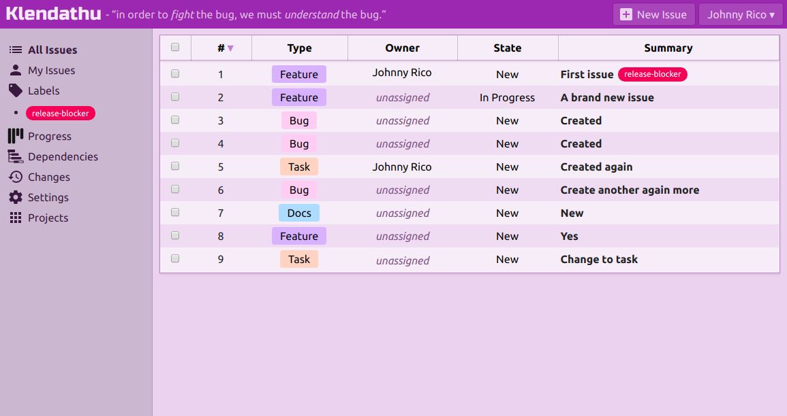
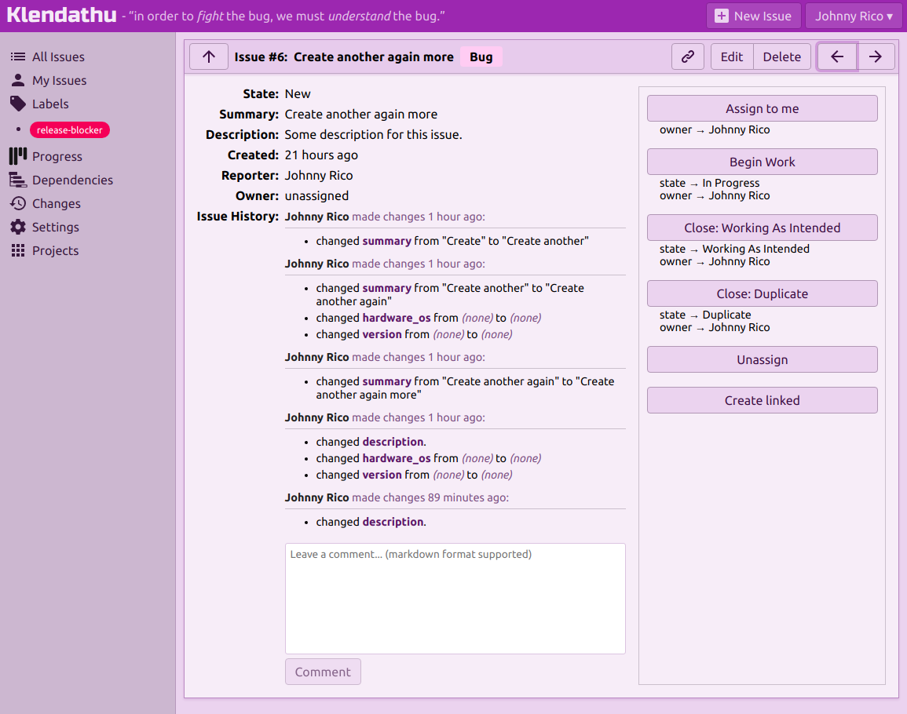

# Klendathu

[](https://circleci.com/gh/viridia/klendathu) [](https://greenkeeper.io/)

Klendathu is an open-source bug tracking and project management application.

# Some early screenshots





# Running locally

```sh
npm install
docker-compose up db db-admin imaginary
CLIENT_PROXY=true npm start
```

Then browse to http://localhost:4000.

# Running integration tests

```sh
npm test
```

# Frameworks, languages and technologies used:

* TypeScript
* React.js
* MobX
* Apollo (client, server, subscriptions)
* WebSockets
* MongoDb
* Parcel
* Express.js
* Passport.js
* Styled-components
* Jest
